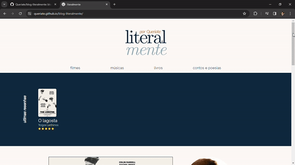

# Projeto "Blog Literalmente"

Bem-vindo ao projeto "Blog Literalmente"! Esta iniciativa visa proporcionar uma experiência única, oferecendo resenhas de filmes, detalhes sobre o autor e outros conteúdos relacionados.

  

  

## Conteúdo
O projeto inclui:

- Página web com resenhas de filmes
- Informações sobre o autor
- Outros conteúdos relevantes

## Pré-requisitos

> Certifique-se de ter um navegador da web moderno instalado para desfrutar da melhor experiência possível.

## Instalação

> git clone https://github.com/seu-usuario/blog-literalmente.git

## Uso

- Acesse a página web para explorar resenhas de filmes e obter informações sobre o autor.

## Contribuição

> Contribuições são bem-vindas! Sinta-se à vontade para abrir uma issue ou enviar um pull request.

## Contato

- Autor: Queriate Silva
- [GitHub](https://github.com/Queriate)
- [LinkedIn](https://www.linkedin.com/in/queriate-silva/)
- Email: queriatejobs@gmail.com

---
